## 现有iOS项目集成Unity工程

### 1.从Unity导出iOS工程，确保可以运行再做下一步

### 2.将导出的工程Classes／Data／Libraries／MapFileParser／MapFileParser.sh放入到你自己的目录下面

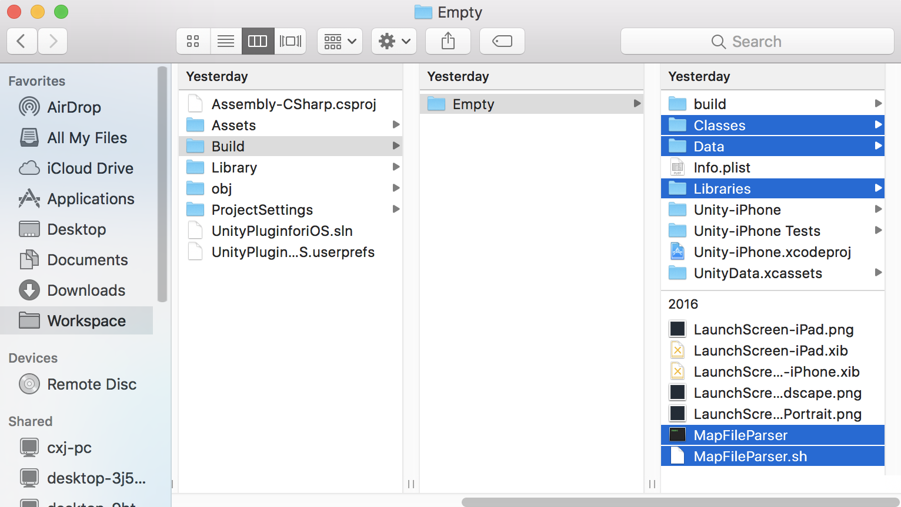
Empty为Unity导出的iOS工程，包含一个空场景
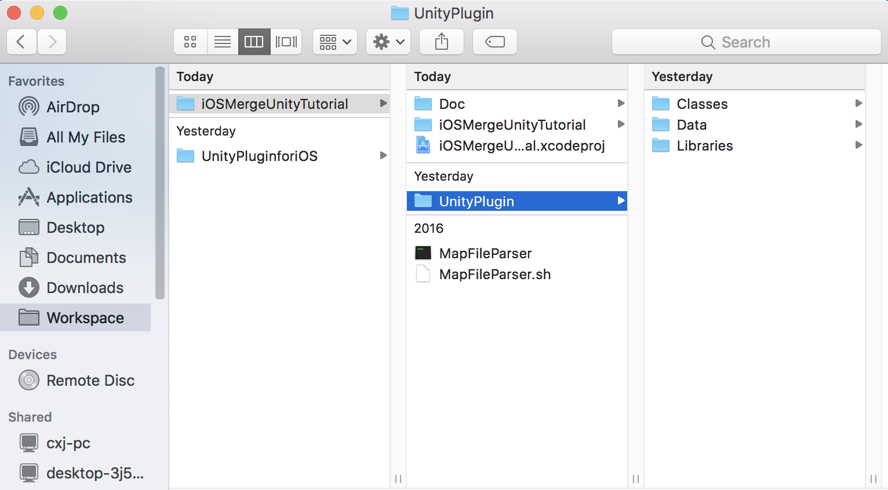
⚠️ MapFileParser和MapFileParser.sh必须放到根目录下面（🔗[What does MapFileParser do?](http://answers.unity3d.com/questions/1038931/what-does-mapfileparser-do.html)）我尝试修改MapFileParser.sh下面的MapFileParser路径，然并卵

⚠️Data文件请选择Create folder reference

如果你的工程看起来是这个样子的，那么请继续
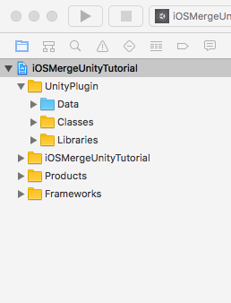

### 3.Build configration

3.1 Header Search Paths

3.2 Library Search Paths
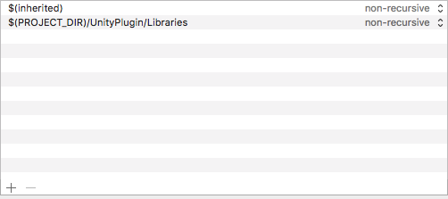
3.3 Link Binary With Libraries
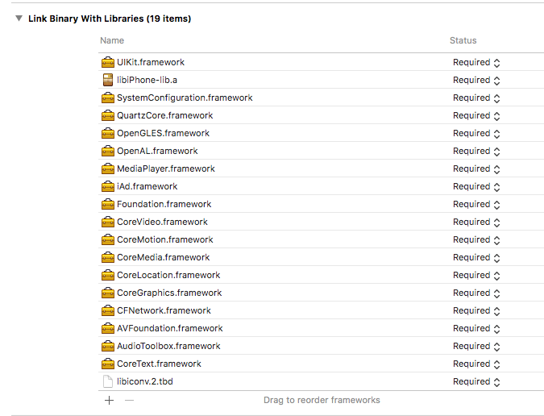
3.4 Run Script
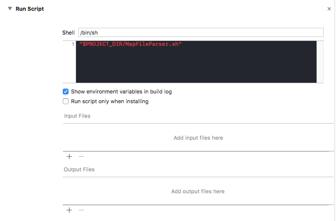
3.5 Custom Compiler Flags
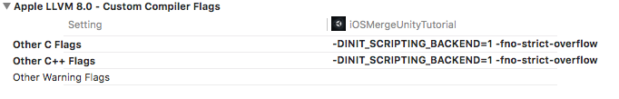
3.6 Prefix Header

请填写你项目中Prefix.pch的路径

### 4.Setup Main
将Unity中/Classes/main.mm文件替换掉iOS项目中原始的main.m（🔗[本示例的main文件](iOSMergeUnityTutorial/iOSMergeUnityTutorial/main.mm)）

### 5. Update AppDelegate
5.1 Add UnityAppController property
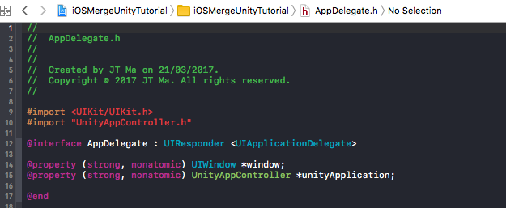
5.2 在AppDelegate中添加UnityAppController对应的方法

（🔗[本示例的AppDelegate文件](iOSMergeUnityTutorial/iOSMergeUnityTutorial/AppDelegate.m)）

### 6.Get UnityAppController
修改GetAppController()方法
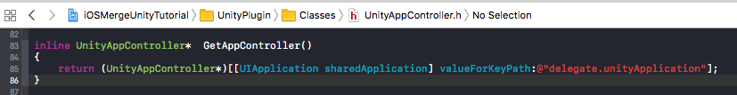

### 至此，你已经完成了现有iOS项目集成Unity工程，接下来就可以使用了，具体使用可以参考示例程序。

## Unity与iOS消息传递

### 1.iOS向Unity推送消息
函数原型: void	UnitySendMessage(const char* obj, const char* method, const char* msg);

@parameter obj: 接收消息对象名
@parameter method: 接收消息函数名
@parameter msg: 传送的消息
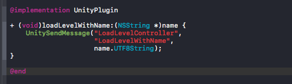
（🔗[本示例的UnityPlugin文件](iOSMergeUnityTutorial/iOSMergeUnityTutorial/Plugin/UnityPlugin.mm)）

Unity接收到消息后可以对消息进行处理（本示例加载不同的场景）
（🔗[本示例的LoadLevelController文件](UnityPluginforiOS/Assets/_Scripts/LoadLevelController.cs)）

### 2.iOS接收Unity消息

2.1 需要Unity提供消息接口
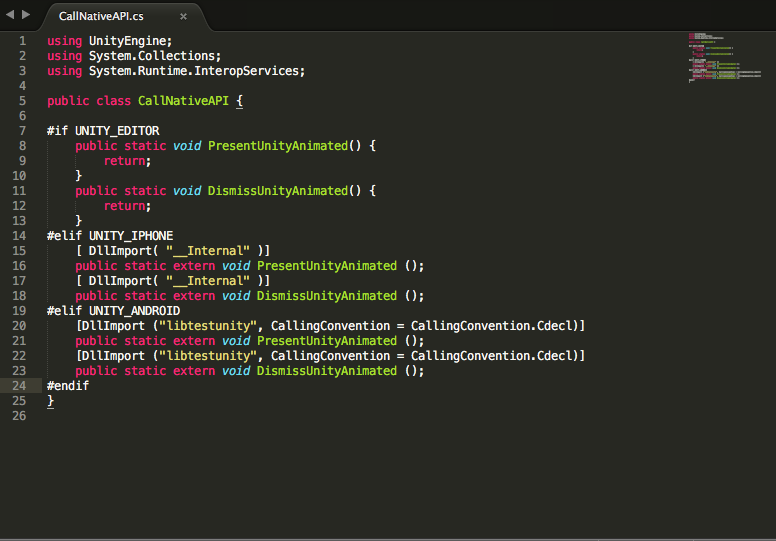
（🔗[本示例的CallNativeAPI文件](UnityPluginforiOS/Assets/_Scripts/CallNativeAPI.cs)）

2.2 iOS消息接收实现（本示例实现隐藏和显示界面）
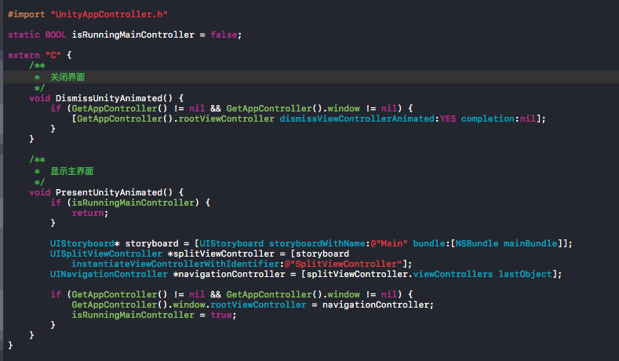
（🔗[本示例的UnityPlugin文件](iOSMergeUnityTutorial/iOSMergeUnityTutorial/Plugin/UnityPlugin.mm)）

## 总结
* 本示例最终ipa大小为13.9MB（空工程），比较大，这是一个是否选择Unity作为渲染引擎的很重要因素